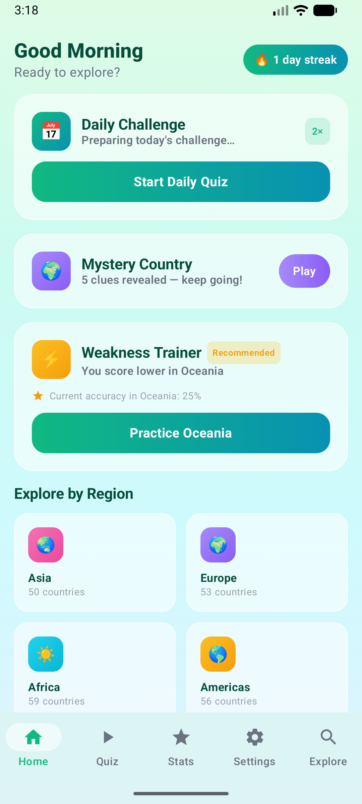
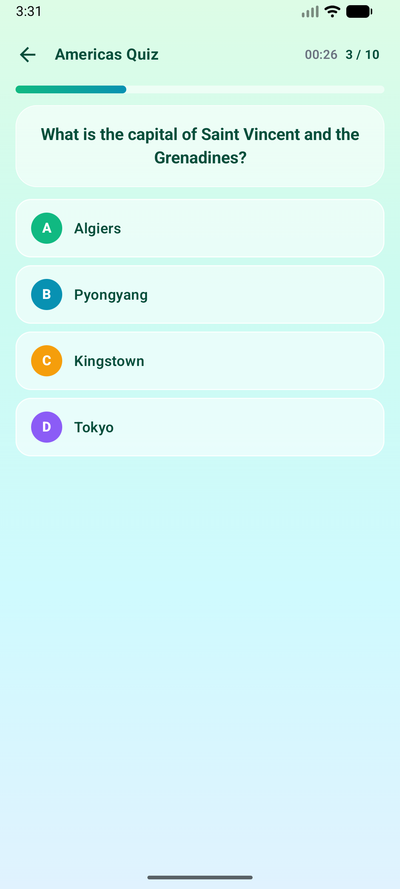
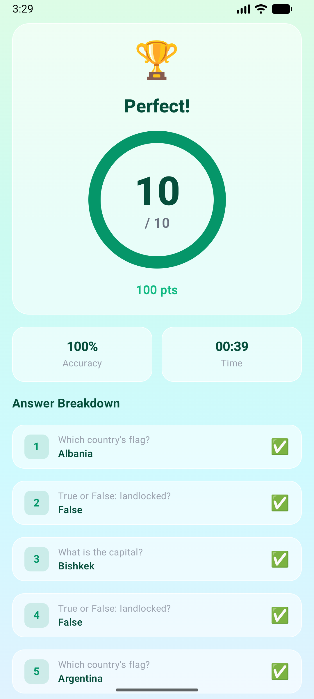
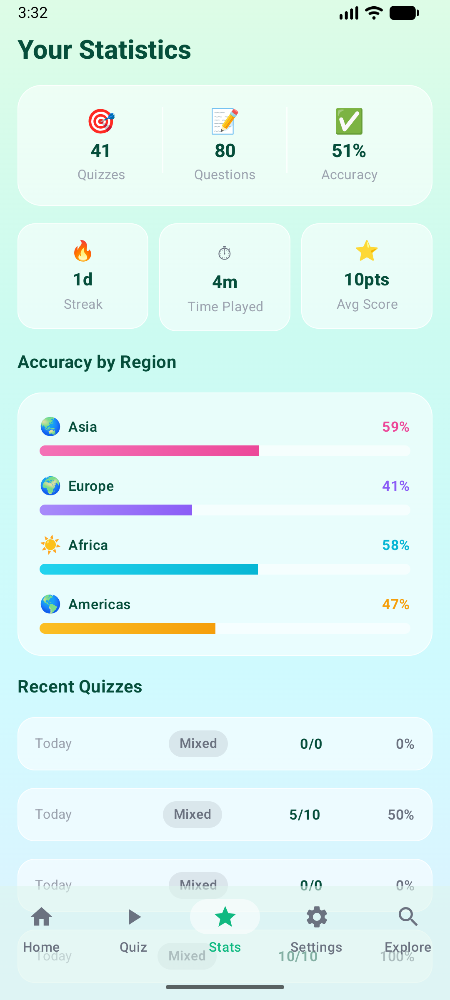
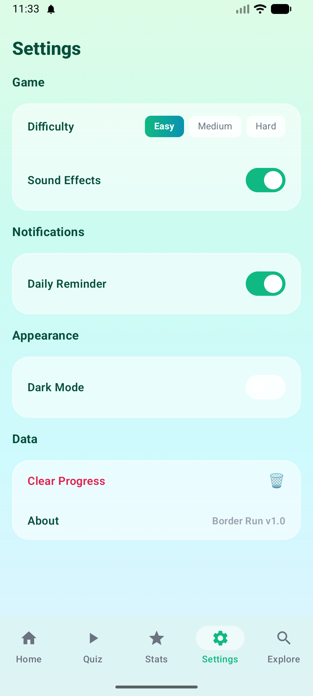
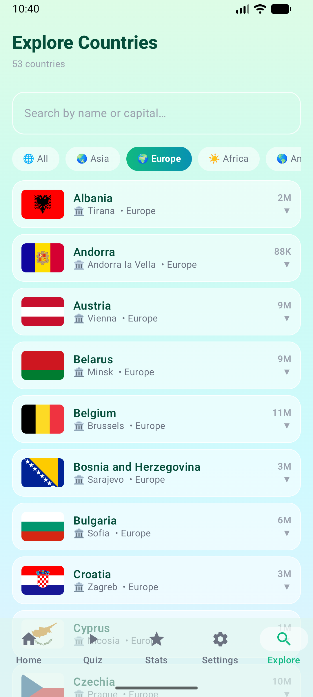

# Border Run

A geography quiz app for Android that teaches world geography through interactive, gamified quizzes. Covering capitals, flags, populations, regions, and more across every country on Earth.

---

## Screenshots

## Screenshots

| Home | Quiz | Result |
|------|------|--------|
|  |  |  |

| Stats | Settings | Explorer |
|-------|----------|----------|
|  |  |  |
---

## Features

### Question Types
Border Run includes six distinct question formats to keep quizzes varied:

| # | Type | Format |
|---|------|--------|
| 1 | **Flag Identification** | See a flag image → pick the correct country from 4 options |
| 2 | **Capital Matching** | "What is the capital of [country]?" → 4 capital options |
| 3 | **Reverse Capital** | "[Capital] is the capital of which country?" → 4 country options |
| 4 | **Region Sorting** | "Which continent is [country] in?" → 4 region options |
| 5 | **Landlocked True/False** | "True or False: [country] is landlocked." |
| 6 | **Population Comparison** | Two countries side by side → tap the more populous one |

### Game Modes
- **Regional Quiz** — Focus on Asia, Europe, Africa, Americas, or Oceania
- **Mixed Quiz** — Questions drawn from all regions at once
- **Daily Challenge** — A fresh 10-question quiz generated every day; one attempt only
- **Mystery Country** — Deduce a mystery country from up to 5 progressive clues (region, population range, landlocked status, capital initial, border count)
- **Weakness Trainer** — Auto-targets the region where your accuracy is lowest; unlocks after 20 answered questions

### Difficulty
- **Easy** — 5 question types (no population comparison)
- **Medium / Hard** — All 6 question types; harder distractors

### Progress & Gamification
- **Day streak** — Tracks consecutive days with at least one completed quiz (30-day window)
- **Weekly activity grid** — Mon–Sun heatmap showing daily quiz performance
- **Per-region accuracy** — Horizontal bar chart breaking down correct-answer rate by continent
- **Streak high score** — Persists your best streak across all sessions

### Explorer
Browse and search all ~195 countries without starting a quiz. Filter by region, search by name or capital, and tap any card to expand full details: official name, subregion, area, languages, currencies, landlocked status, driving side, and border list.

### Settings
- Difficulty preference, timed mode, sound effects, hint display
- Daily reminder notification (with full permission rationale flow)
- Clear all local data

---

## Technical Stack

| Layer | Technology |
|-------|-----------|
| Language | Kotlin 1.9 |
| UI framework | Jetpack Compose (Material Design 3) |
| Architecture pattern | MVVM + Clean Architecture |
| Dependency injection | Hilt (Dagger) |
| Local database | Room 2.6 |
| Networking | Retrofit 2 + OkHttp |
| JSON parsing | Gson |
| Image loading | Coil 2 |
| Background work | WorkManager |
| Navigation | Navigation Compose |
| Async | Kotlin Coroutines + Flow |
| Min SDK | API 26 (Android 8.0) |
| Target SDK | API 34 (Android 14) |

---

## Architecture

Border Run follows **Clean Architecture** with three distinct layers, enforced by package structure.

```
com.borderrun.app
├── data/
│   ├── local/          # Room DAOs, entities, database
│   ├── remote/         # Retrofit service, DTOs
│   └── repository/     # Repository implementations
├── domain/
│   ├── model/          # Pure Kotlin domain models
│   ├── repository/     # Repository interfaces
│   └── usecase/        # One class per business operation
└── ui/
    ├── home/           # Home screen + ViewModel
    ├── quiz/           # Quiz screen + ViewModel
    ├── result/         # Quiz Result screen + ViewModel
    ├── stats/          # Statistics screen + ViewModel
    ├── settings/       # Settings screen + ViewModel
    ├── mystery/        # Mystery Country screen + ViewModel
    ├── weakness/       # Weakness Trainer screen + ViewModel
    ├── explorer/       # Explorer screen + ViewModel
    ├── permission/     # Permission Rationale screen
    ├── components/     # Shared composables (BottomNavBar, etc.)
    └── theme/          # Design system (colours, typography, shapes)
```

### Key Design Decisions

**MVVM + StateFlow** — Every screen has a single `ViewModel` exposing one `StateFlow<UiState>`. Composables call `collectAsState()` and are fully stateless; all logic lives in the ViewModel or use cases.

**Repository pattern** — The UI layer never touches Room or Retrofit directly. All data access goes through repository interfaces defined in `domain/`, implemented in `data/`. This keeps the domain layer free of Android dependencies and straightforwardly testable.

**Use cases** — Each discrete business operation (generate quiz, sync countries, compute streak, get weakness data, etc.) is a single `UseCase` class with an `operator fun invoke()`. ViewModels compose multiple use cases rather than embedding logic themselves.

**Offline-first** — Country data is fetched from the RestCountries API by `ContentSyncWorker` (WorkManager) and cached in Room. All reads serve from Room; the network is only contacted when the cache is older than 24 hours. The app is fully functional without an internet connection after first launch.

**Reactive UI** — Room DAOs return `Flow<T>`, which propagates through repositories and use cases into ViewModel `StateFlow`s via `combine`. The entire UI re-renders automatically whenever the underlying data changes — no manual refresh calls.

---

## Data Source

Country data is sourced from the **RestCountries v3.1 API** (`https://restcountries.com/`).

Because the API limits requests to 10 fields each, country data is fetched in two sequential calls and merged by cca3 country code before being written to Room:

| Call | Fields fetched |
|------|---------------|
| Basic | name, cca3, capital, flags, population, region, subregion, languages, currencies, borders |
| Extra | name, cca3, area, landlocked, car (driving side), timezones |

No API key is required. The RestCountries API is free and open.

---

## Screens

| Screen | Description |
|--------|-------------|
| **Home** | Greeting, streak pill, Daily Challenge card, Mystery Country teaser, region grid, weekly activity, stats summary, Weakness Trainer CTA |
| **Quiz** | Question card (flag image or text), answer options (A/B/C/D or True/False or side-by-side compare), live timer, progress bar, per-question feedback and explanation |
| **Quiz Result** | Score ring, correct/wrong/avg-time stats, per-question answer review, Play Again and Home actions |
| **Statistics** | Four stat cards, accuracy-by-region bar chart, activity calendar heatmap, weakness tip card |
| **Settings** | Quiz preferences, notification toggle, data management, Clear All My Data |
| **Mystery Country** | Daily mystery with progressive clue reveal, free-text guess input, Give Up option, result card with flag |
| **Weakness Trainer** | Targeted quiz session for the user's weakest region; reuses the full Quiz UI |
| **Explorer** | Searchable, filterable list of all ~195 countries with expandable detail cards |
| **Permission Rationale** | Full-screen explanation of POST_NOTIFICATIONS permission with privacy commitments before the system dialog is shown |

---

## Testing

### Unit Tests — 39 passing

Run with:
```bash
./gradlew test
```

| Test class | Tests | What it covers |
|------------|-------|----------------|
| `QuestionGeneratorTest` | 13 | Question count, correct answer always in options, 4 options per MC, region filtering, empty pool, easy/medium type distribution |
| `CountryRepositoryImplTest` | 11 | DAO-to-domain mapping, empty cache, sync calls upsertAll, network error propagation, count and timestamp queries |
| `GetHomeStatsUseCaseTest` | 6 | All four stats fields, null accuracy → 0f, null high score → 0, empty data |
| `HomeViewModelTest` | 8 | Initial loading state, isLoading flips after data arrives, region counts, syncError on failure with/without cache, greeting helper |
| `ExampleUnitTest` | 1 | Gradle-generated sanity check |

**Testing libraries:** JUnit 4 · MockK 1.13.9 · Turbine 1.0.0 · kotlinx-coroutines-test 1.8.1

### Instrumented (Compose) Tests

Run with a connected device or emulator:
```bash
./gradlew connectedDebugAndroidTest
```

| Test class | Tests | What it covers |
|------------|-------|----------------|
| `HomeScreenTest` | 6 | All 5 bottom-nav labels visible, active tab suppresses callback, inactive tab fires correct enum value |
| `QuizScreenTest` | 9 | Question text displayed, 4 MC options displayed, option click fires callback, True/False options, progress counter, CompareTwo question text |

---

## Building the App

### Prerequisites
- Android Studio Hedgehog (2023.1.1) or newer
- Android SDK API 34
- JDK 17 (bundled with Android Studio)

### Steps

1. **Clone the repository**
   ```bash
   git clone https://github.com/<your-username>/BorderRun.git
   cd BorderRun
   ```

2. **Open in Android Studio**
   - File → Open → select the `BorderRun` directory
   - Android Studio will detect the Gradle project automatically

3. **Sync Gradle**
   - Click **Sync Now** in the yellow banner, or
   - File → Sync Project with Gradle Files

4. **Run the app**
   - Select a device or emulator from the toolbar (API 26+)
   - Press **Run** (Shift+F10) or click the green play button

5. **Run unit tests**
   ```bash
   ./gradlew test
   ```

> **Note:** The app fetches country data from the RestCountries API on first launch. An internet connection is required for the initial sync; subsequent launches work fully offline.

---

## Privacy & Ethics

Border Run is designed with **privacy by design** from the ground up:

- **No analytics or tracking.** The app contains no third-party analytics SDKs, advertising libraries, or crash-reporting services. No user behaviour is transmitted anywhere.

- **Data stays on-device.** All quiz history, streak data, and preferences are stored exclusively in a local Room database. Nothing is uploaded to a server.

- **Data minimisation.** The only external data fetched is country reference data from the public RestCountries API — no personal information is involved. Country data is cached locally and refreshed at most once every 24 hours.

- **Runtime permissions with rationale.** The app requests `POST_NOTIFICATIONS` (Android 13+) for optional daily reminders. Before the system dialog appears, a full-screen rationale screen explains exactly what the permission is used for, what it is not used for, and that it can be declined or revoked at any time. No permission is requested without prior context.

- **User control.** Settings includes a **Clear All My Data** action that permanently deletes all local quiz history, cached country data, and preferences from the device.

- **No background location.** Despite early design explorations, the app does not request or use location data in any form.

---

## Licence

This project is submitted as academic coursework at James Cook University. All rights reserved.
